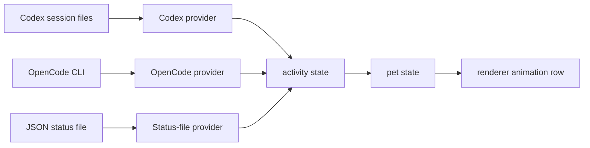

# Architecture

## Runtime

Agent Pets is an Electron desktop app with a transparent frameless window. The main process owns filesystem access and IPC. The renderer owns animation playback and display.

```text
Electron main
  pet-store.cjs
  settings.cjs
  providers/codex.cjs
  providers/opencode.cjs
  providers/json-status.cjs
  validate-pet.cjs
  IPC
    pets:list
    activity:read

Electron renderer
  renderer.js
  renderer.css
  renderer.html
```

## Modules

### `src/main/pet-store.cjs`

Reads local pet packages from the configured Codex home. It validates:

- Manifest exists and is JSON.
- `spritesheetPath` resolves inside the package folder.
- Sprite image is PNG or WebP.
- Sprite dimensions are exactly `1536x1872`.

### `src/main/settings.cjs`

Stores local app settings under Electron `userData`: selected pet, selected state mode, status-file path, and window bounds. Settings are local only and are not written into `.codex`.

### `src/main/providers/codex.cjs`

Reads:

- `${CODEX_HOME}/session_index.jsonl`
- matching files under `${CODEX_HOME}/sessions/**/rollout-*<session-id>.jsonl`

It samples recent JSONL records and infers session status from file freshness, pending tool calls, request-user-input markers, and failure markers. This is a best-effort provider because Codex session files are not a stable public API.

### `src/main/providers/json-status.cjs`

Reads a user-provided status file for non-Codex agents:

```json
{
  "state": "running",
  "title": "External agent",
  "detail": "Working",
  "updatedAt": "2026-05-13T10:00:00.000Z"
}
```

Valid states are `idle`, `running`, `waiting`, `failed`, and `review`.

### `src/main/providers/opencode.cjs`

Reads OpenCode sessions through the public CLI command:

```bash
opencode session list --format json --max-count 8
```

It normalizes session summaries into the shared activity model without reading private OpenCode storage files directly.

### `src/main/validate-pet.cjs`

Validates local pet packages for agents and contributors. It checks manifest shape, path traversal, sprite image type, and exact atlas dimensions.

### Renderer

The renderer uses the Codex atlas contract:

- `8x9` grid.
- CSS `background-size: 800% 900%`.
- Background position from column and row percentages.
- Non-idle states play three cycles, then return to long idle.

## Status Flow



## Future Packaging

The package exposes `agent-pets` and `pets` bins now. A production release should add:

- signed Windows installer
- portable Windows build
- macOS DMG
- Linux AppImage or deb
- CI smoke test on each platform

## Security Boundary

Pet packages are data only. The renderer receives data URLs for validated sprite atlases; it does not execute pet code. Provider adapters must stay read-only unless a future feature explicitly adds user-approved actions.
